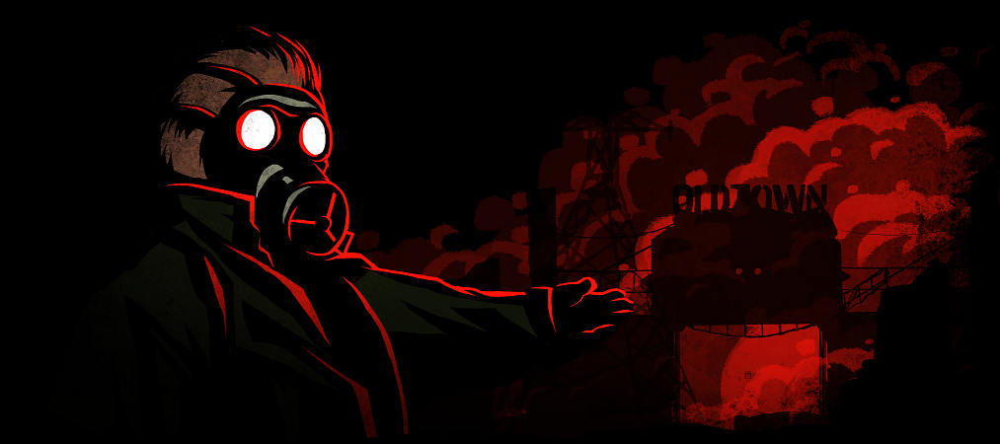

	

# Saper - the game

### Bartosz Kozak & Sara Winiarek

####

* [Ogólne informacje](#Ogólne_informacje)
* [Technologia](#technologia)
* [Ustawienia](#ustawienia)

## Ogólne informacje
Ten projekt jest prostą grą, której celem jest oznaczenie (oflagowanie) wszystkich ładunków wybuchowych umieszczonych pod ziemią. Ranking jest oceniany na bazie czasu, im szybciej saper oznaczy podłożone ładunki, tym wyższe miejsce zamie w rankingu, należy jednak uważać i być szybkim gdyż terroryści ustawili zegar odliczający do detonacji.
	
## Technologia
Projekt jest stowrzony przy użyciu:
* java version: 1.8.0_251 

## Sterowanie
W grze sterujemy używając myszy i jej przycisków. LPM klikamy w celu odkrycia zakrytego fragmentu pola minowego, a PPM aktywuje tryb oflagowywania, następnie LWP ustawiamy flagę w miejscu podłożonego ładunku. W celu wyjścia z trybu oflagowywania, należy ponownie wcisnąć PPM.
- PPM - tryb oflagowywania
- LPM - odkrywanie planszy.
- Przycisk "Poddaj się" - powoduje natychmiastową przegraną i wyjście do menu.
- Przycisk "Restart" - resetuje ustawienia i ponownie uruchamia grę.
	
## Ustawienia
W celu uruchomienia projektu należy zmienić ściężkę dostępu do plików w katalogu src/main/resources na swoją ścieżkę.

 	
